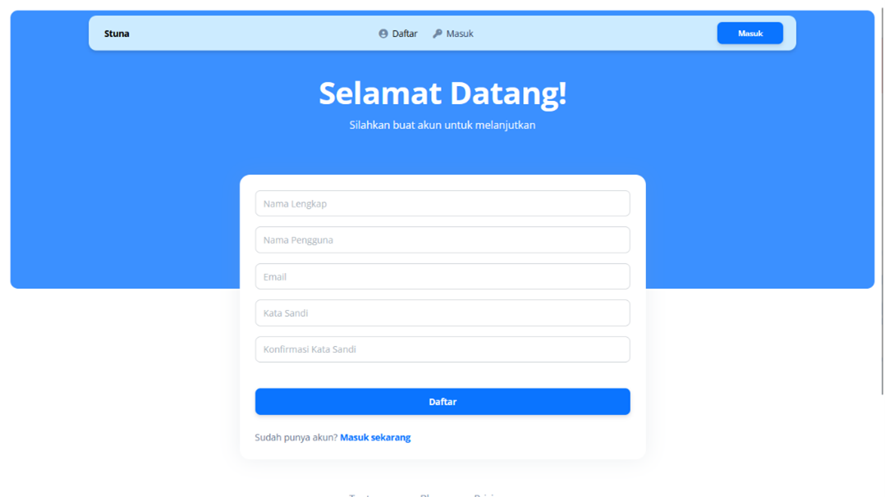
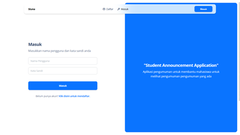
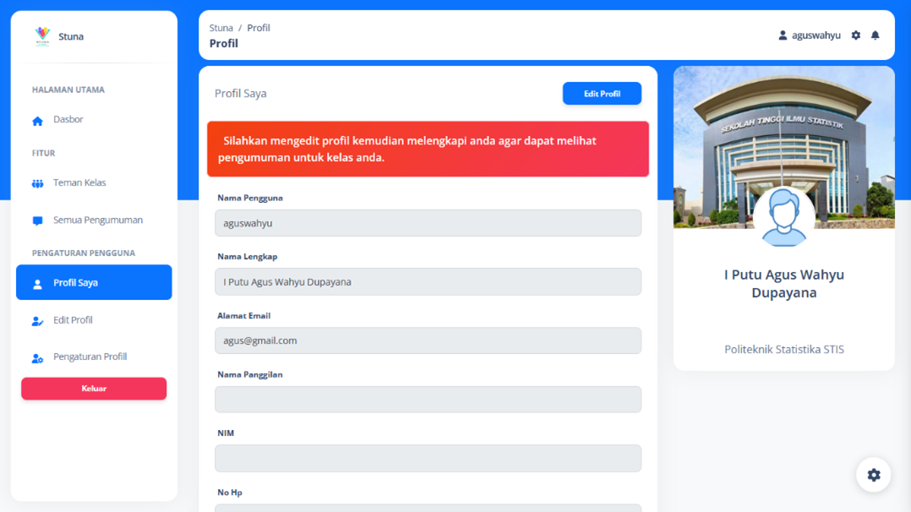
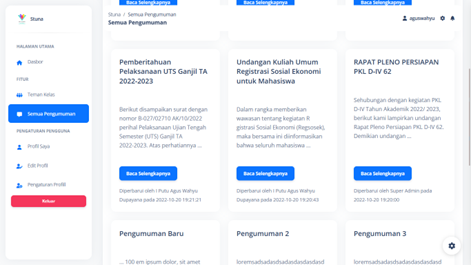
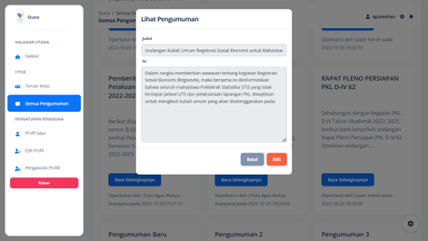
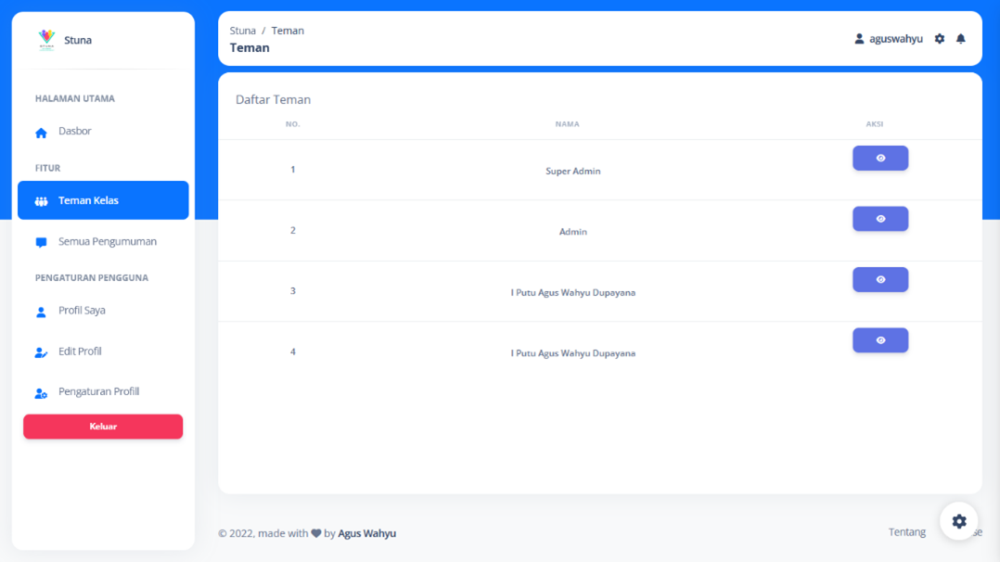
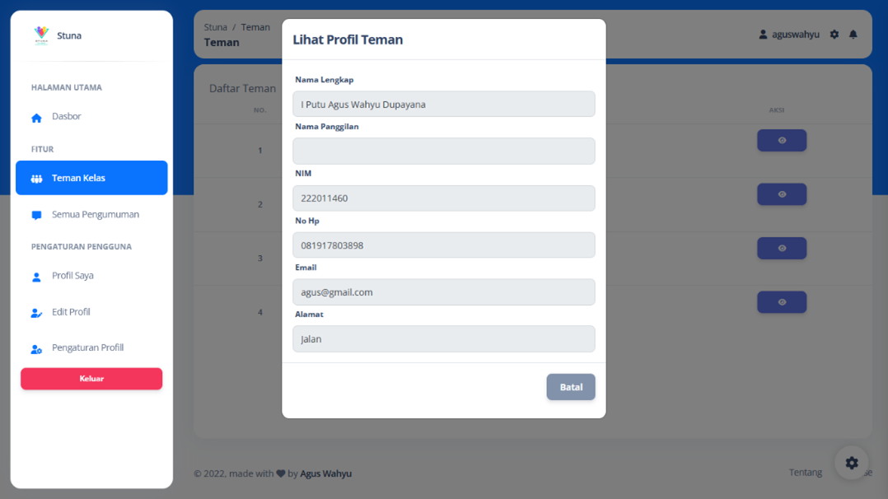

# Dokumentasi Stuna Client Web

## Description

This project is a web client for Stuna. This project was created with the Vue JS framework.

## Screenshots

## Tentang

Kode ini dibawah lisensi MIT. Silahkan baca [Lisensi](license.txt) untuk informasi lebih lanjut.

Client Web ini dibuat dengan Javascript dan menggunakan framework [Vue.js](https://vuejs.org/). Selain itu juga menggunakan template dari [Creative Tim Argon Dashboard 2](https://www.creative-tim.com/product/argon-dashboard).

## Instalasi

Silahkan ikuti langkah-langkah berikut untuk menginstall Stuna Client Web.

1. Clone repository ini
2. Masuk ke direktori repository
3. Jalankan perintah `npm install`
4. Jalankan perintah `npm run serve`
5. Buka browser dan akses `http://localhost:8081`
6. Jika ingin melakukan build, jalankan perintah `npm run build`

Terdapat file env yang harus diisi dengan data-data yang dibutuhkan. Silahkan copy file `env` menjadi `.env` dan isi dengan data-data yang dibutuhkan.
